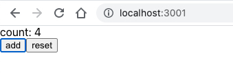
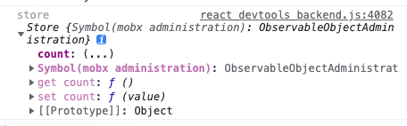
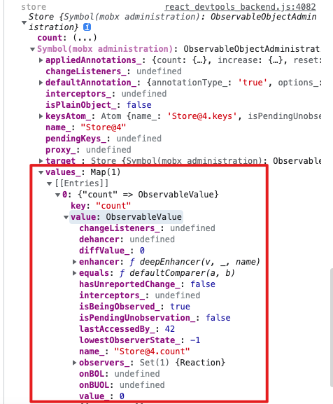

# MobX的核心功能解析

## MobX的三大概念

### 1. 定义 State 并使其可观察

`State`(状态) 是驱动你的应用程序的数据。

只要确保所有你想随时间改变的属性都被标记为`observable`，这样`MobX`就可以跟踪它们。

示例：

```javascript
import { makeObservable, observable, action } from "mobx"

class Todo {
  id = Math.random()
  title = ""
  finished = false

  constructor(title) {
    makeObservable(this, {
      title: observable,
      finished: observable,
      toggle: action
    })
    this.title = title
  }

  toggle() {
    this.finished = !this.finished
  }
}
```

### 2. 使用 Action 更新 State

`Action`(动作) 是任意可以改变`State`(状态) 的代码，比如用户事件处理、后端推送数据处理、调度器事件处理等等。

使用`Action`可以更好地组织代码，并防止在无意中修改`State`。


### 3. 创建 Derivations 以便自动对 State 变化进行响应

任何来源是`State`(状态) 并且不需要进一步交互的东西都是 `Derivation`(派生)。

`Mobx`区分了两种`Derivation`:

1. Computed values,总是可以通过纯函数从当前的可观测`State`中派生。
2. Reactions, 当`State`改变时需要自动运行的副作用 (命令式编程和响应式编程之间的桥梁)

## MobX的原则

Mobx 使用单向数据流，利用 action 改变 state ，进而更新所有受影响的 view

 

1. 所有的 derivations 将在 state 改变时自动且原子化地更新。因此不可能观察中间值。
2. 所有的 derivations 默认将会同步更新，这意味着 action 可以在 state 改变 之后安全的直接获得 computed 值。
3. computed value 的更新是惰性的，任何 computed value 在需要他们的副作用发生之前都是不激活的。
4. 所有的 computed value 都应是纯函数,他们不应该修改 state。

## MobX和Redux的区别

首先MobX和Redux都是单向数据流，都通过action触发全局state更新，然后通知视图。

它们主要的区别是修改状态的方式不一样。

1. Redux 是每次返回一个全新的状态，一般搭配实现对象`immutable`的库来用。
2. MobX 每次都是修改的同一个状态对象，基于响应式代理，也就是`Object.defineProperty`代理`get`、`set`的处理，`get`时把依赖收集起来，`set`修改时通知所有的依赖做更新。和`vue@2.x`的响应式代理很类似。
3. 其中，Redux 那种方式是函数式的思路，所以状态的修改都在一个个`reducer`函数里，而 MobX 那种方式则是面向对象的代理的思路，所以很容易把`state`组织成一个个`class`。
这也就导致了两种状态管理方式的代码组织是有区别的：

Redux 是在`reducer`函数里组织状态（函数式的特点）：

```javascript
const reducer = (state = 0, action) => {
  switch (action.type) {
    case 'INCREMENT': return state + 1;
    case 'DECREMENT': return state - 1;
    default: return state;
  }
};
```

而 MobX 则是在`class`里组织状态（面向对象的特点）：

```javascript
import {observable, action} from 'mobx';
class Store {
  @observable number = 0;
  @action add = () => {
    this.number++;
  }
}
```

此外，Redux 那种方式每次都要返回一个新的对象，虽然可以用 immutable 的库来减少创建新对象的开销，但是比起 MobX 直接修改原对象来说，开销还是大一点。

而且 redux 通知依赖更新的时候是全部通知的，而 MobX 因为收集了每个属性的依赖，可以精准的通知。

**所以 MobX 的性能会比 Redux 高一些。**

总结一下，**MobX 和 Redux 都是单向数据流，但是管理状态的思路上，一个是函数式的思想，通过 reducer 函数每次返回新的 state，一个是面向对象的思想，通过响应式对象来管理状态，这导致了状态组织方式上的不同（function/class），而且 Redux 创建新的 state 的开销还有通知所有依赖的开销都比 MobX 大，性能比 MobX 差一些。**

## MobX核心源码的实现

首先看一个简单的例子

```jsx
import { observable } from 'mobx'
import { observer } from 'mobx-react'
import React from 'react'

class Store {
  state = observable({
    count: 0
  })

  increase () {
    this.state.count += 1
  }

  reset () {
    this.state.count = 0
  }
}

const store = new Store()

@observer
class View extends React.Component {
  render () {
    const { store } = this.props
    return <div>
      <div>count: {store.state.count}</div>
      <button onClick={() => store.increase()}>add</button>
      <button onClick={() => store.reset()}>reset</button>
    </div>
  }
}

const App = () => {
  return <View store={store} />
}

export default App
```



这里的store被MobX处理成这样了，对象count属性分为了 get 和 set，实际上是通过`Object.defineProperty`做了响应式处理



同时store下的mobx administration也记录了依赖这个属性的view，这是如何做到的，通过阅读源码可以知道，当我们用observer包裹了组件，实现了一个高阶组件，它对组件做了一层代理并返回新的组件，react-mobx在这层代理中创建了reaction对象，在回调函数中调用setState进行强制更新。



当然，这里收集的不是具体哪个组件，而是回调函数，也就是收到更新的通知之后如何做出反应。

这样就完成了依赖的收集，在后面修改响应式对象的状态属性的时候，就会触发依赖，然后实现组件的更新。

接下来自己建一个文件夹来重点实现`oberver`和`ovservable`这两个方法。

首先需要实现一个EventEmitter来实现发布订阅模式。

```javascript
// events.js
export default class EventEmitter {
  list = {};
  on(event, fn) {
    let target = this.list[event];
    if (!target) {
      this.list[event] = [];
      target = this.list[event];
    }
    if (!target.includes(fn)) {
      target.push(fn);
    }
  };
  emit(event, ...args) {
    const fns = this.list[event];
    if (fns && fns.length > 0) {
      fns.forEach(fn => {
        fn && fn(...args);
      });
    }
  }
};
```

接下来实现`observable`和`autorun`，其中`autorun`是MobX的核心，之后会由它来驱动视图更新

```javascript
// mobx.js
import EventEmitter from './events';

const em = new EventEmitter();
let currentFn;

const autorun = (fn) => {
  const warpFn = () => {
    currentFn = warpFn;
    fn();
    currentFn = null;
  }
  warpFn();
};

const observable = (obj) => {
  // 用 Symbol 当 key；这样就不会被枚举到，仅用于值的存储
  const data = Symbol('data');
  obj[data] = JSON.parse(JSON.stringify(obj));

  Object.keys(obj).forEach(key => {
    if (typeof obj[key] === 'object') {
      observable(obj[key]);
    } else {
      Object.defineProperty(obj, key, {
        get: function () {
          if (currentFn) {
            em.on(obj, key, currentFn);
          }
          return obj[data][key];
        },
        set: function (v) {
          // 值不变时不触发
          if (obj[data][key] !== v) {
            obj[data][key] = v;
            em.emit(obj, key);
          }
        }
      });
    }
  });
  return obj;
};

export {
  autorun,
  observable
}
```

可以看到，使用`Object.defineProperty`时，我们在定义时就能为可观察对象的所有的`key`都确定好唯一的信道。从而准确地收集依赖。

以上代码实现了MobX模型的响应式数据，并且在数据改变的时候可以通过autorun回调触发更新，测试用例如下

```javascript
// example.js
import { observable, autorun } from './mobx';

const store = observable({ a: 1, b: { c: 1 } });

autorun(() => {
  if (store.a === 2) {
    console.log(store.b.c);
  }
});

store.b.c = 5;
store.b.c = 6;
store.a = 2; // 6
```

后面要做的事情就是`react-mobx`需要做的，在组件初次渲染的时候收集依赖，并且在数据更新的时候触发autorun重新渲染，由于源码信息量非常大，这里篇幅有限，只做简单的实现。

```javascript
// mobx-react.js
import { autorun } from './mobx'

// 此处是仅支持类组件的实现方式，后续需要更新函数式组件的实现方式
function observer(target) {
  const _componentWillMount = target.prototype.componentWillMount
  target.prototype.componentWillMount = function() {
      _componentWillMount && _componentWillMount.call(this)
      autorun(() => {
        this.render()
        this.forceUpdate()
      })
  }
  return target
}

export {
  observer
}
```

可以把最开始的用例中的observer和observable改为从本地代码引入验证一下，效果和MobX基本一致。

```jsx
import { observable } from './my-mobx/mobx'
import { observer } from './my-mobx/mobx-react'
import React from 'react'

class Store {
  state = observable({
    count: 0
  })

  increase () {
    this.state.count += 1
  }

  reset () {
    this.state.count = 0
  }
}

const store = new Store()

@observer
class View extends React.Component {
  render () {
    const { store } = this.props
    return <div>
      <div>count: {store.state.count}</div>
      <button onClick={() => store.increase()}>add</button>
      <button onClick={() => store.reset()}>reset</button>
    </div>
  }
}

const App = () => {
  return <View store={store} />
}

export default App
```

以上就是MobX核心功能**响应式数据**和**依赖收集**的实现，后续计划继续更新`Action`和`Computed`的实现，敬请期待。

## 参考文档

MobX中文文档：https://www.mobxjs.com/observable-state

observable和autorun的实现解析：https://xie.infoq.cn/article/d90440a8fb574299b4454ef96